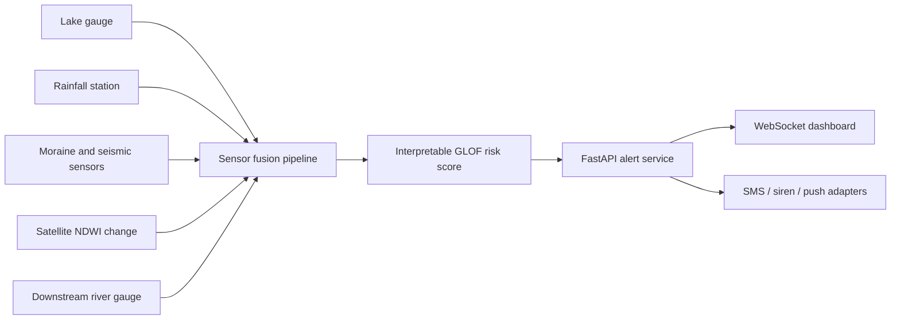

# GLOF Sentinel

GLOF Sentinel is a full-stack early warning system for Glacier Lake Outburst Flood prediction. It combines simulated lake-gauge, rainfall, snowmelt, moraine-stability, seismic, satellite, and downstream-flow telemetry into an interpretable risk score, then streams evacuation alerts to an operations dashboard.

This project is designed to be resume-ready: it demonstrates disaster-risk AI, FastAPI backend engineering, real-time WebSocket alerts, React dashboard design, and a clean ML pipeline that can later be connected to real sensors or satellite data.

## Resume Summary

**Glacier Lake Outburst Flood Early Warning System | FastAPI, React, scikit-learn, WebSockets**

- Built an end-to-end GLOF prediction platform that fuses hydrometeorological, geotechnical, seismic, satellite, and downstream river telemetry.
- Implemented an interpretable risk-scoring pipeline with staged warnings: watch condition, high-risk preparation, and evacuation trigger.
- Developed a FastAPI backend with JWT authentication, live alert APIs, WebSocket broadcasting, in-memory telemetry state, and notification-adapter hooks.
- Created a React operations dashboard with basin risk map, live warning feed, command login, and demo telemetry simulation for project presentations.

## Architecture

- `ml/` - risk model, telemetry simulation, and pipeline orchestration
- `backend/` - FastAPI API, auth, alert service, runtime state, and WebSocket alert stream
- `frontend/` - React dashboard for disaster-management teams
- `docs/architecture.md` - deeper system design and deployment plan



## Quick Start

### Backend

```bash
cd backend
..\.venv\Scripts\python.exe -m pip install -r requirements.txt
..\.venv\Scripts\python.exe -m uvicorn app.main:app --reload
```

### Frontend

```bash
cd frontend
npm install
npm run dev
```

Prototype login:

- Username: `admin`
- Password: `glofsentinel123`

## Demo Workflow

1. Start the backend from `backend/`.
2. Start the frontend from `frontend/`.
3. Open the dashboard and sign in with the prototype credentials.
4. Click `Start GLOF Simulation`.
5. Watch the basin risk map and warning feed update as the simulated monsoon breach scenario intensifies.

## Warning Logic

The model computes normalized feature contributions for:

- lake level
- hourly lake-level rise
- rainfall intensity
- warm-temperature snowmelt
- moraine instability
- micro-seismic tremor
- satellite water-index expansion
- downstream river discharge

The backend emits staged alerts when risk crosses operational thresholds:

- `watch_condition` for above-baseline monitoring
- `high_glof_risk` for field verification and evacuation readiness
- `evacuation_trigger` for critical downstream response
- specific diagnostic alerts such as `rapid_lake_rise`, `moraine_failure_signal`, and `satellite_lake_expansion`

## Extension Ideas

- Connect real IoT sensors via MQTT or AWS IoT Core.
- Replace demo satellite values with Sentinel-2 NDWI extraction.
- Persist alerts and telemetry in PostgreSQL/PostGIS.
- Add flood-routing estimates using a DEM and downstream settlement exposure data.
