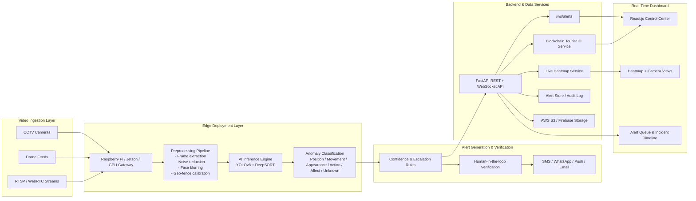

# Crowd Guard Architecture

## End-to-End Architecture

## Processing Flow

1. Streams enter through edge gateways near camera sources.
2. Frames are sampled, denoised, and privacy protected with face anonymization.
3. YOLOv8 detects people, vehicles, and objects while DeepSORT maintains tracking IDs.
4. Anomaly engines score position, movement, appearance, action, affect, and unknown patterns.
5. Alerts are confidence-ranked, optionally operator-verified, and distributed through Twilio, push, and email.
6. Metadata, anonymized frames, and audit records are stored in backend services and cloud storage.
7. The dashboard consumes live alerts and crowd heatmaps over REST and WebSocket APIs.

## Privacy and Security

- Face blurring is applied before storage and downstream analytics.
- JWT protects authority endpoints.
- Tourist identities are hash-anchored for tamper-evident verification.
- Edge inference reduces raw video egress and improves latency.
