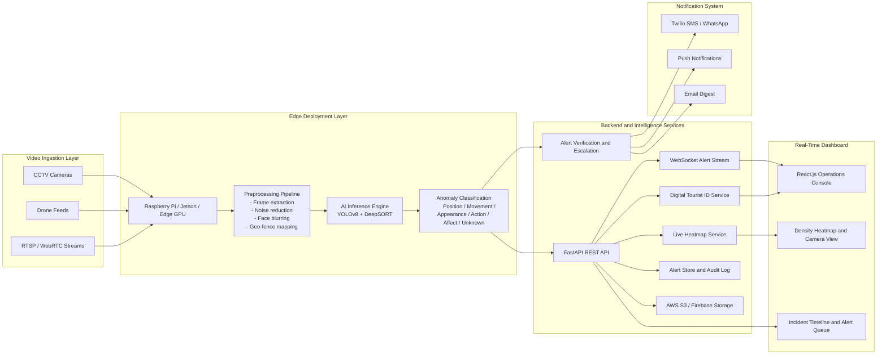

# Crowd Guard Architecture

## End-to-End System Diagram

## Runtime Flow

1. CCTV, drone, or RTSP feeds are registered through the backend.
2. Frames are extracted and anonymized with face blurring before deeper processing.
3. YOLOv8 identifies people, vehicles, and suspicious objects.
4. DeepSORT maintains object identity across frames.
5. The anomaly engine scores:
   - anomalous position
   - anomalous movement
   - anomalous appearance
   - anomalous action
   - anomalous affect
   - unknown anomaly patterns
6. Alerts are confidence-ranked, stored, broadcast to the dashboard, and passed into escalation logic.
7. Heatmap points and live alert telemetry are exposed to the React dashboard.
8. Tourist IDs can be registered and verified through a blockchain-style hashing layer.

## Privacy and Security

- Face anonymization happens before downstream analytics.
- Authority APIs use JWT authentication.
- Tourist IDs are anchored using deterministic hashing for tamper-evident verification.
- Edge-first processing reduces unnecessary raw video transfer.
- Cloud integrations should use encrypted object storage and signed-access patterns.

## Deployment Strategy

- Edge inference for low-latency monitoring
- FastAPI backend as the coordination and alerting layer
- React dashboard for command and monitoring teams
- Optional PostgreSQL, Redis, S3, Firebase, Twilio, and FCM integrations for production
